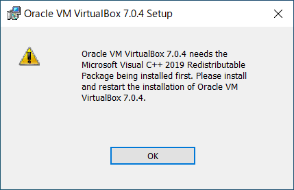

※“Oracle VM VirtualBox 7.X.X needs the Microsoft Visual C++ 2019 Redistributable Packaging being installed first.”のようなメッセージが表示された場合、
Microsoftのサイトからダウンロードしてインストールしてください。
（<a href="https://visualstudio.microsoft.com/ja/downloads/">https://visualstudio.microsoft.com/ja/downloads/</a> “Microsoft Visual C++ Redistributable for Visual Studio 2022”）*

メッセージ例

